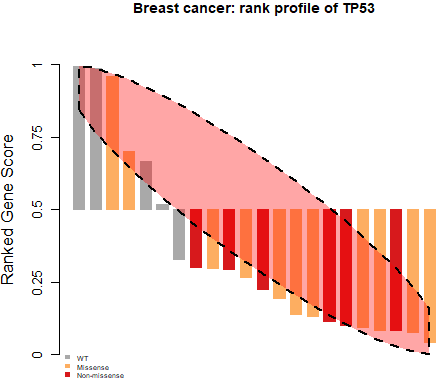

# APSiC
The whole data sets analayzed in this manuscript are published as a part of project DRIVE (https://data.mendeley.com/datasets/y3ds55n88r/5) and at the DepMap data portal (https://depmap.org/portal/download). The breast cancer data is available as an R object in this repository (`R/BreastData.RData`). 

To find tumor suppressive effectors, use the `identifyDependencies` function with argument `dependencyType = "tumor-suppressive-effectors`:
```
source("apsic_common_functions.r")
load("BreastData.RData")

# The APSiC for detecting tumor suppressive effectors
identifyDependencies(breastData, dependencyType = "tumor-suppressive-effectors")
```
The `dependencyType` argument takes values from `tumor-suppressive-effectors`, `tumor-promoting-effectors`, 
`amplified-cancer-genes`, `missense-mutational-cancer-genes`, `non-missense-mutational-cancer-genes` to find the cancer dependencies defined in the manuscript.


To plot the rank profiles, the `waterfallForGene` function can be used:
```
gene = "TP53"
waterfallForGene(breastData, gene=gene, title=paste("Breast cancer: rank profile of", gene), rank=TRUE)
```
<p align="center">
 
</p>

# Manuscript
The manuscript is available at:
[https://www.biorxiv.org/content/10.1101/807248v2](https://www.biorxiv.org/content/10.1101/807248v2)

# P-value files
APSiC p-values for 26 cancers as well as pan-cancer data for identification of genetic drivers and effectors are available [here.](hits/)


# Shiny app
A web portal using the Shiny framework in R has been developed to visualize rank profiles of the DRIVE shRNA screen and corresponding gene expression data from TCGA at https://apsic.scicore.unibas.ch/. 

### Contributions
- [Hesam Montazeri](http://lcbb.ut.ac.ir/)
- [Salvatore Piscuoglio](http://oncogenomicslab.org/lab-members/)
- [Charlotte K Y Ng](http://oncogenomicslab.org/lab-members/)

### Contact
```
hesam.montazeri (at) ut.ac.ir
charlotte.ng (at) dbmr.unibe.ch
```
